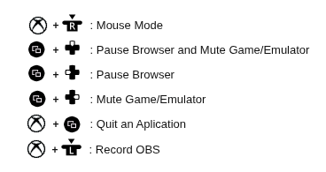
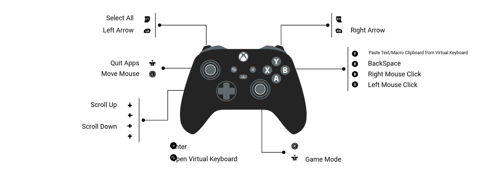

<p align="center">
    
</p>

# Root Control Mapper

Joystick mapper for Linux developed in Rust. It allows mapping custom keys and scripts (Bash/Python), featuring a virtual keyboard optimized for controllers.

<p align="center">
<a href="#usage">Usage</a> - <a href="#installation">Installation</a> - <a href="readme/helper.md#customizing-commands">Commands</a> - <a href="readme/helper.md#custom-scripts">Scripts</a> - <a href="dev/guide.md">Development</a>
</p>

# 🎮 Use only your Joystick without a mouse and without a keyboard ✨

<p align="center">
<video controls muted src="https://github.com/user-attachments/assets/106b42c0-d611-489c-bdbb-9c703cccbb58" with="250px" height="250px"></video>
</p>

## Project goals (current and future)
- Create a flexible and customized experience for using the controller on Linux with all its features, *without limitations*.
- Fix potential bugs and add more keys as needed and as the project evolves.
- Add compatibility with the Xbox Series controllers' share button.

## Installation
1. Extract the `.tar.gz`
2. Give the necessary permissions to the script and run the installation command:
```shell
chmod +x install.sh
./install.sh
```
3. Verify the installation with the command:
```shell
root-ctrl-mapper -v
```
4. If you want to check the available commands:
```shell
root-ctrl-mapper -hc
```

## Usage

To use it, just run: 

```shell
root-ctrl-mapper
``` 


## Pre-configured Commands

It is not necessary to configure any command, all of them are pre-configured during installation. Below is the default configuration for each respective operation Mode:

## Game Mode

<div style="text-align: center;">
    
</div>

> In this operation mode, all of them are button combos so they do not affect your gaming experience.

## Mouse Mode

<div style="text-align: center;">
    
</div>


- To change buttons, macros, and scripts, consult the [helper]("readme/helper.md") 
- If you want to run it in the background without the terminal, type `root-ctrl-mapper -b` and if you want to close the app in the background type `root-ctrl-mapper -k`. All commands are available in the [helper]("readme/helper.md#commands") of this repository.


<p align="center">
  <a href="https://www.buymeacoffee.com/renan_zx" target="_blank">
    
  </a>
</p>
