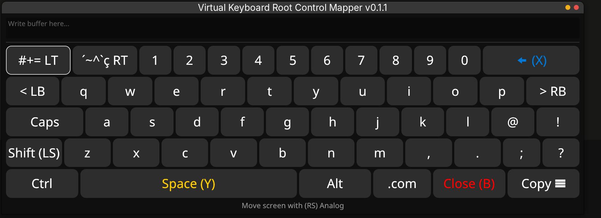
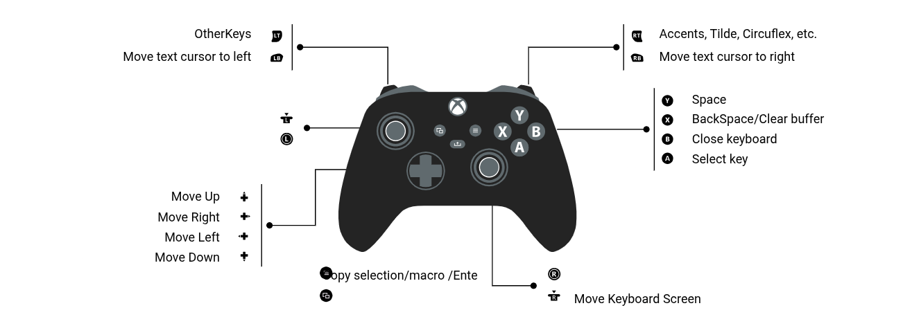

# Commands

There are 8 commands available in root-ctrl-mapper:
- `-v` - Print Version
- `-b` : Opens the app in the background
- `-k` : Kills the background app instance
- `-j` : Queries the path of the JSON files containing the mapped buttons/keys
- `-s` : Queries the path of the scripts
- `-h` : Queries this helper document available on GitHub
- `-hc` : Opens the CLI command line helper

> You can check all available commands by typing `root-ctrl-mapper -hc`

# About Configurations

The root control mapper comes pre-configured for use, accompanied by two useful scripts to improve your gameplay experience.

# Custom Scripts
- `pp-browser`: If you want to play while listening to music, a podcast, or watching a video in the web browser while the emulator/game is muted, this script allows you to toggle between pausing a video/audio and muting/unmuting a game.
> This script is only compatible with the Brave browser

- `record_obs`: A script that records gameplays from OBS in the background, without the need to open it manually, if you want to record gameplay while playing.

You can customize your own scripts by either providing the full script path or adding the script inside the `scripts` folder at the root of the `root-ctrl-mapper` installation—just navigate to it:

```shell
cd $(root-ctrl-mapper -s)
```


# Operation Modes

The root control mapper has 2 interchangeable operation modes:

- `Game Mode`: Mode to use during your gaming sessions. You can configure scripts to take screenshots, record gameplays, execute custom macros, or do whatever you want while playing your games on your Linux machine.
- `Mouse Mode`: Mode to use when navigating your computer, moving the mouse, or typing on the keyboard using a `virtual keyboard` with a controller-friendly interface provided by the root control mapper.

> When starting the app, the default mode is `Game Mode`. To change it, just press the mode switch sequence.

# Customizing Commands

Open the `json` directory at the root of the program installation; there you will find two `.json` files named `game_mode.json` and `mouse_mode.json`. Both files represent each operation mode respectively.

The following list contains all mappable buttons/macros to customize your configuration.

# Mappable Buttons (Controller)

- BTN_SELECT
- BTN_START
- BTN_HOME or BTN_MODE
- BTN_RECORD
- BTN_LB
- BTN_RB
- BTN_LT
- BTN_RT
- BTN_LTHUMB
- BTN_RTHUMB
- BTN_A
- BTN_B
- BTN_X
- BTN_Y
- DPAD_LEFT
- DPAD_UP
- DPAD_DOWN
- DPAD_RIGHT

> Analogs (LEFT_STICK/RIGHT_STICK) can only be mapped to the mouse pointer.

# Mappable Keys/Buttons (Mouse and Keyboard)

- ALT
- KEY_LEFTALT
- KEY_RIGHTALT
- CTRL
- KEY_LEFTCTRL
- KEY_RIGHTCTRL
- SHIFT
- KEY_LEFTSHIFT
- KEY_RIGHTSHIFT
- BACKSPACE
- ENTER
- RETURN
- ESC
- ESCAPE
- SPACE
- MOUSE_RIGHTCLICK
- MOUSE_LEFTCLICK
- ARROW_RIGHT
- ARROW_LEFT
- ARROW_UP
- ARROW_DOWN
- SCROLL_DOWN
- SCROLL_UP
- BACKSPACE
- KEY_A
- KEY_B
- KEY_C
- KEY_D
- KEY_E
- KEY_F
- KEY_G
- KEY_H
- KEY_I
- KEY_J
- KEY_K
- KEY_L
- KEY_M
- KEY_N
- KEY_O
- KEY_P
- KEY_Q
- KEY_R
- KEY_S
- KEY_T
- KEY_U
- KEY_V
- KEY_W
- KEY_X
- KEY_Y
- KEY_Z
- KEY_0
- KEY_1
- KEY_2
- KEY_3
- KEY_4
- KEY_5
- KEY_6
- KEY_7
- KEY_8
- KEY_9
- KEY_F1
- KEY_F2
- KEY_F3
- KEY_F4
- KEY_F5
- KEY_F6
- KEY_F7
- KEY_F8
- KEY_F9
- KEY_F10
- KEY_F11
- KEY_F12

> The record button has currently been tested and validated only on the `Gamesir Nova Lite` controller.

## Buttons

- `buttons`: The sequence of one or more buttons from your Xbox controller to be mapped.

## Macro

- `macro_keys`: Represents the combination of one or more keyboard keys to be executed by a sequence defined in `buttons`.

## Script

- `exec`: Path to a bash script or the script name if it is in the `scripts` folder.
- `py_exec`: Path to a python script or the script name if it is in the `scripts` folder.

## Special Flags (json)

- `change_mode`: Changes the controller operation mode to mouse/game depending on the `.json` file configuration.
- `virtual_keyboard`: Activates the virtual keyboard (available only in `mouse mode`).
- `mouse_move`: Moves the mouse pointer (available only in `mouse mode` and can only be assigned to the `LEFT_STICK/RIGHT_STICK` analogs).
- `clipboard_buffer`: The clipboard buffer (available only in `mouse mode`) of the virtual keyboard (`virtual_keyboard`). You can save text to the buffer or a `macro` (key combination) using the virtual keyboard.

## Click Types
- `double_click`: Receives a double click from the controller input.
- `long_press`: Receives a long press click from the controller input.

# How to customize your configurations

- Open the `json` folder at the root of your installation: 
```shell
cd $(root-ctrl-mapper -j)
```


- You will find two files: `game_mode.json` and `mouse_mode.json`.

- Customize your configuration according to the following template:

```json
[
    {"buttons": ["BTN_A"], "exec": "meu_script.sh"},
    {"buttons": ["BTN_RTHUMB"], "change_mode": true},
    {"buttons": ["BTN_HOME", "BTN_SELECT"], macro_keys:["KEY_F5"]},
    {"buttons": ["BTN_HOME"], "double_click": true, "py_exec": "meu_script.py"}
    ...
]

```

> `Game Mode` is the mode you will use during your gameplays. It is highly recommended to always use a button combo with `BTN_HOME` or `BTN_SELECT` so that it does not affect your experience while playing.

# How to use the virtual keyboard

<p align="center">
    
</p>

The root ctrl mapper virtual keyboard is a keyboard designed to facilitate controller (joystick) use when typing text or using a command in Linux. Below is the legend explaining what each button does:

<p align="center">
    
</p>
